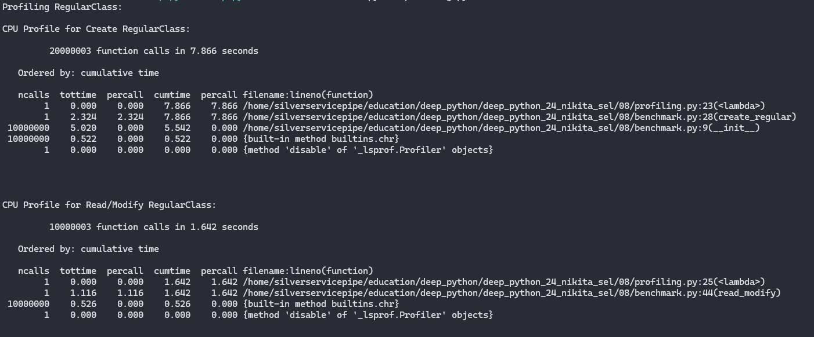
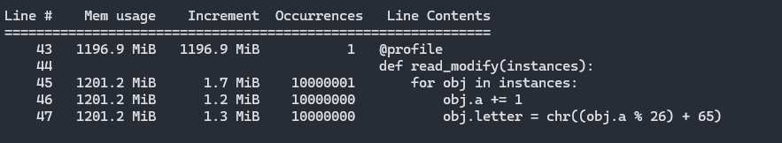

# Домашнее задание #08 (память, профилирование)

> Все замеры будут производиться с размером выборки N = 10**7

### 1. Сравнение использования weakref и слотов
Запуск и сравнение:

- Создание объектов:
    - *Regular* и *Slots* классы имеют схожее время на создание объектов, при этом *Slots* немного быстрее благодаря экономии памяти через использование слотов.
    - *WeakRef* класс значительно медленнее, что ожидаемо. Это связано с дополнительной работой по созданию слабых ссылок для каждого объекта, что замедляет процесс.
- Чтение и изменение атрибутов:
    - Время доступа и изменения атрибутов у *Regular* и *Slots* классов одинаковое, что говорит о том, что слоты не приносят значительного выигрыша на этапе чтения/записи атрибутов.
    - *WeakRef* немного медленнее, потому что для каждого объекта нужно вызывать слабую ссылку (obj()) и проверять, не был ли объект уничтожен. Это накладывает дополнительную нагрузку.

### 2. Профилирование

#### Замеры Regular:

Создание экземпляров класса:
- Общее время выполнения: 7.866 секунд.
- Основное время уходит на выполнение конструктора класса *RegularClass* (5.542 секунд для 10 миллионов объектов). Это 65% времени.
- Время, затраченное на функцию *chr* для вычисления символов, составляет 0.522 секунд, что является небольшим, но заметным фактором при таком большом количестве объектов.

Чтение/запись атрибутов класса:
- Общее время выполнения: 1.642 секунд.
- Время, затраченное на выполнение функции read_modify, составляет 1.116 секунд. Это время включает вызовы для каждого из 10 миллионов объектов, где модификация атрибутов объекта (увеличение значения *a* и изменение символа *letter*) занимает основное время.
- Как и в случае с созданием объектов, большая часть времени тратится на выполнение функции *chr*, хотя это значение меньше, чем при создании объектов (0.526 секунд).

-----

#### Замеры Slots:

Создание экземпляров класса:
- Общее время выполнения: 7.263 секунд.
- Основное время, как и в случае с классом *RegularClass*, тратится на выполнение конструктора \_\_init\_\_, который для 10 миллионов объектов занимает 5.054 секунд. Это составляет около 69% общего времени.
- Функция *chr* снова занимает 0.523 секунд для выполнения 10 миллионов вызовов.

Чтение/запись атрибутов класса:
- Общее время выполнения: 1.768 секунд.
- Модификация атрибутов занимает 1.196 секунд.
- Время, затраченное на функцию *chr*, составляет 0.572 секунд.

-----

#### Замеры WeakRef:

Создание экземпляров класса:
- Общее время выполнения: 11.668 секунд.
- Время, потраченное на создание экземпляров объектов, составляет 6.326 секунд (это время для выполнения всего *create_weakref*).
- Основное время уходит на создание объектов, где \_\_init\_\_ занимает 5.342 секунд.
- Время, затраченное на выполнение функции *chr*, составляет 0.542 секунд.

Чтение/запись атрибутов класса:
- Общее время выполнения: 2.338 секунд.
- Время, потраченное на модификацию атрибутов, составляет 1.762 секунд (включая все проверки и изменение данных).
- Время, затраченное на выполнение функции *chr*, также составляет 0.576 секунд.

-----

#### Выводы
- **Время создания экзепляров класса**:
    - *RegularClass*: Создание экзепляров класса занимает 7.866 секунд. Это стандартный класс с обычными атрибутами.
    - *SlotsClass*: Создание экзепляров класса немного быстрее, 7.263 секунд, благодаря использованию \_\_slots\_\_, который сокращает накладные расходы на хранение атрибутов.
    - *WeakRefClass*: Создание экзепляров класса занимает больше времени — 11.668 секунд. Это связано с дополнительными операциями по установке слабых ссылок на каждый объект, что увеличивает накладные расходы.

**Вывод**:
1. Использование \_\_slots\_\_ улучшает производительность за счет оптимизации памяти и сокращения накладных расходов на атрибуты.
2. Слабые ссылки (weakref) требуют дополнительных операций, что замедляет создание объектов. Это объясняется как дополнительными вычислениями для установки слабых ссылок, так и необходимостью обработки слабых ссылок, которые могут быть удалены сборщиком мусора.

---
- **Время на чтение и модификацию атрибутов**:
    - *RegularClass*: Время на чтение и изменение атрибутов — 1.642 секунд.
    - *SlotsClass*: Чтение и изменение атрибутов — 1.768 секунд, что быстрее на несколько миллисекунд по сравнению с обычными атрибутами, благодаря оптимизации памяти с использованием \_\_slots\_\_.
    - *WeakRefClass*: Чтение и изменение атрибутов занимает 2.338 секунд, что на 30% медленнее, чем у обычных классов. Это объясняется дополнительными операциями для проверки и получения объектов через слабую ссылку (obj()).

**Вывод**:
1. *SlotsClass* также показывает преимущество в скорости работы с атрибутами, поскольку слоты уменьшают накладные расходы на хранение атрибутов в объектах.
2. *WeakRefClass* существенно отстает из-за необходимости каждое изменение атрибута через слабую ссылку проверять доступность объекта. Это приводит к дополнительным вычислениям и повышенному времени на доступ и изменение атрибутов.

---

**Использование памяти при создании экземпляров**:
- *RegularClass*:
    - Память: увеличение на 1150.7 MiB при создании объектов.
    - Это стандартный класс с обычными аттрибутами, использует больше памяти по сравнению с другими классами.

- *SlotsClass*:
    - Память: увеличение на 996.1 MiB при создании объектов.
    - Использование \_\_slots\_\_ экономит память, уменьшая накладные расходы на хранение атрибутов.

- *WeakRefClass*:
    - Память: увеличение на 1154.2 MiB при создании объектов и дополнительное 842.1 MiB для слабых ссылок.
    - Использование слабых ссылок увеличивает потребление памяти из-за хранения референций и слабых ссылок для каждого объекта.

**Вывод**
1. *SlotsClass* использует наименьше памяти благодаря оптимизации через \_\_slots\_\_.
2. *RegularClass* и *WeakRefClass* требуют больше памяти, при этом *WeakRefClass* имеет дополнительное потребление из-за слабых ссылок.

---

**Использование памяти при чтение и модификацию атрибутов**:
- *RegularClass*:
    - Mem usage: Начальное потребление памяти 1196.9 MiB.
    - Increment: Увеличение на 1.7 MiB при начале цикла, увеличения на 1.2 MiB и 1.3 MiB в процессе выполнения.

- *SlotsClass*:
    - Mem usage: Начальное потребление памяти 1043.8 MiB.
    - Increment: Нет увеличений памяти, несмотря на изменения в атрибутах.

- *WeakRefClass*:
    - Mem usage: Начальное потребление памяти 2048.9 MiB.
    - Increment: Нет увеличений памяти, так как слабые ссылки не требуют дополнительного размещения в памяти.

**Вывод**:
1. *RegularClass*: Увеличение памяти минимальное, так как изменения в атрибутах объектов не требуют перераспределения памяти.
2. *SlotsClass*: Память не увеличивается, что подтверждает эффективность использования слотов для хранения атрибутов.
3. *WeakRefClass*: Память не увеличивается, так как слабые ссылки не загружают объекты в память, если они не используются.
